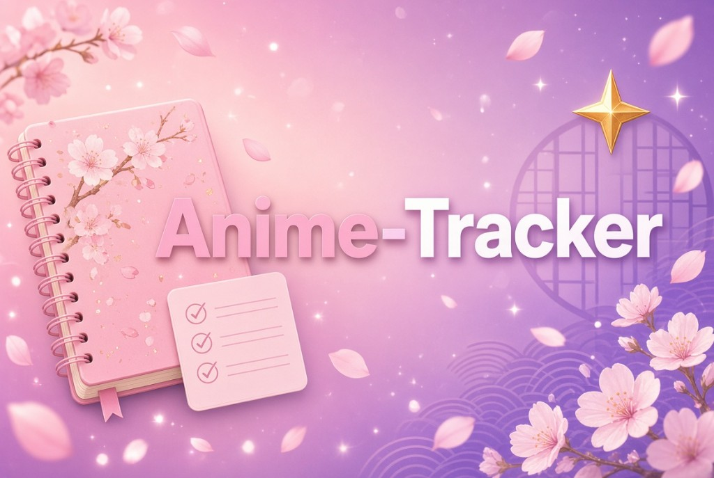

<p align="center">
  
</p>

<p align="center">
  <b>A local desktop library for anime and movies.</b><br>
  No account. No API keys. Your list stays on your machine.
</p>

<p align="center">
  <a href="https://github.com/toeffe/anime-tracker/releases/latest"></a>
  <a href="https://github.com/toeffe/anime-tracker/releases"></a>
  <a href="LICENSE"></a>
</p>

<p align="center">
  <a href="https://github.com/toeffe/anime-tracker/releases/latest"><b>Download the portable .exe</b></a>
  ·
  <a href="https://github.com/toeffe/anime-tracker/releases">All releases</a>
</p>

## Features

- Search AniList, MyAnimeList, and Wikidata
- Track seasons and episodes, with star ratings — mark a whole season watched or unwatched in one click
- **For you** recommendations from your ratings, plus **Trending** and genre browse. Titles already in your library are hidden. Add queues in the background
- In-app trailers (start when you press play)
- One portable Windows build — `tracker.db` lives next to the `.exe` (or a folder you pick in Settings)

## Download

Prebuilt binaries are published under **[Releases](https://github.com/toeffe/anime-tracker/releases)**. Use the latest Windows portable `.exe`. No installer: put it in a folder and run it. By default the library file (`tracker.db`) is created beside the executable. Settings can point it at another folder.

## Privacy

Metadata is fetched from public APIs (AniList, Jikan/MAL, Wikidata). Your watch list, ratings, and progress never leave your computer.

| Mode | Library file |
| --- | --- |
| Packaged app | `tracker.db` next to the `.exe`, unless you pick another folder in Settings |
| Development | `data/tracker.db`, unless you pick another folder in Settings/cog |


## Development

Requires Node.js 22+ and [Visual Studio Build Tools](https://visualstudio.microsoft.com/visual-cpp-build-tools/) (C++ workload) so `better-sqlite3` can compile for Electron.

```bash
npm install
npm --prefix renderer install
npm run dev
```

```bash
npm run package
```

## License

[MIT](LICENSE)
